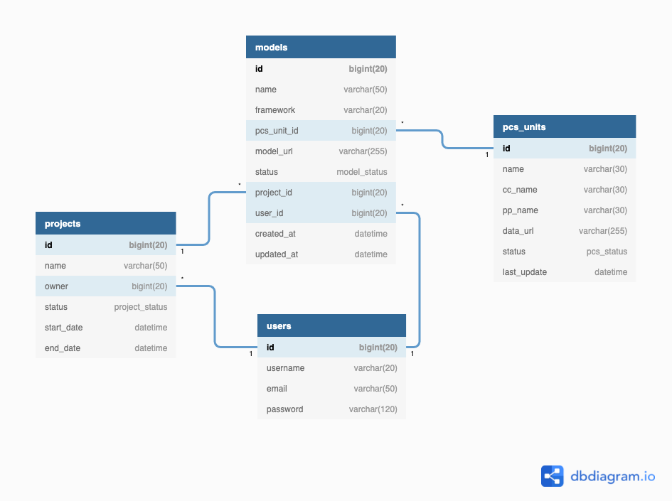

# Entity-Relationship Diagram

[Entity-Relationship Diagram in dbdiagram.io](https://dbdiagram.io/d/62393cacbed6183873d3ae2d)

# Table Overview

| Table Name | Description                                                                    |
| ---------- | ------------------------------------------------------------------------------ |
| users      | Store the user's information used to log in to the system                      |
| pcs_units  | The list of **Power Control Systems** (PCS) of power plants                    |
| models     | The list of existing machine learning models (Power Generation Predict models) |
| projects   | The list of projects                                                           |

# Table Details

### Table: users

| Field    | Description         | Type                | Null | Key | Default | Extra          |
| -------- | ------------------- | ------------------- | ---- | --- | ------- | -------------- |
| id       |                     | bigint(20) unsigned |      | PK  |         | auto_increment |
| username | Registered username | varchar(20)         |      |     |         |                |
| email    | Registered email    | varchar(50)         |      |     |         |                |
| password | Registered password | varchar(120)        |      |     |         |                |

#### Indexes

| Keyname  | Type   | Field    |
| -------- | ------ | -------- |
| username | UNIQUE | username |
| email    | UNIQUE | email    |

### Table: pcs_units

| Field       | Description                                                                                                               | Type                | Null | Key | Default | Extra          |
| ----------- | ------------------------------------------------------------------------------------------------------------------------- | ------------------- | ---- | --- | ------- | -------------- |
| id          |                                                                                                                           | bigint(20) unsigned |      | PK  |         | auto_increment |
| name        | PCS's name                                                                                                                | varchar(30)         |      |     |         |                |
| cc_name     | CC's name                                                                                                                 | varchar(30)         |      |     |         |                |
| pp_name     | Power plant's name                                                                                                        | varchar(30)         |      |     |         |                |
| data_url    | Link to csv file in S3 bucket                                                                                             | varchar(255)        |      |     |         |                |
| status      | Status of the data, **1 (available)** if there is enough data to perform the training and **0 (not available)** otherwise | ENUM(0, 1)          |      |     |         |                |
| last_update | Date of last modification of data                                                                                         | datetime            |      |     |         |                |

### Table: models

| Field       | Description                                     | Type                                                                     | Null | Key | Default | Extra          |
| ----------- | ----------------------------------------------- | ------------------------------------------------------------------------ | ---- | --- | ------- | -------------- |
| id          |                                                 | bigint(20) unsigned                                                      |      | PK  |         | auto_increment |
| name        | Model's name                                    | varchar(50)                                                              |      |     |         |                |
| framework   | Python framework of the model                   | varchar(20)                                                              |      |     |         |                |
| pcs_unit_id | The id of the PCS's data that used for training | bigint(20)                                                               |      | FK  |         |                |
| model_url   | Link to model stored in S3 bucket               | varchar(255)                                                             | YES  |     |         |                |
| status      | Status of model                                 | enum('draft', 'training', 'completed', 'published', 'failed', 'aborted') |      |     |         |                |
| project_id  | The id of project that model belong to          | bigint(20)                                                               |      | FK  |         |                |
| user_id     | The id of user that created model               | bigint(20)                                                               |      | FK  |         |                |
| created_at  | Model created date                              | datetime                                                                 |      |     | now()   |                |
| updated_at  | Model modified date                             | datetime                                                                 |      |     | now()   |                |

### Table: projects

| Field      | Description                    | Type                                                         | Null | Key | Default | Extra          |
| ---------- | ------------------------------ | ------------------------------------------------------------ | ---- | --- | ------- | -------------- |
| id         |                                | bigint(20) unsigned                                          |      | PK  |         | auto_increment |
| name       | Project's name                 | varchar(50)                                                  |      |     |         |                |
| owner      | The id of user who own project | bigint(20)                                                   |      | FK  |         |                |
| status     | Project's status               | enum('pending', 'running', 'completed', 'failed', 'aborted') |      |     |         |                |
| start_date | Project started date           | datetime                                                     |      |     | now()   |                |
| end_date   | Project end date               | datetime                                                     |      |     |         |                |

# Relationships

- `users` < `models`: **one-to-many**: one user may has many models
- `users` < `projects`: **one-to-many**: one user may has many projects
- `pcs_units` < `models`: **one-to-many**: one PCS's data can be use in many models
- `project` < `models`: **one-to-many**: one project has many models
